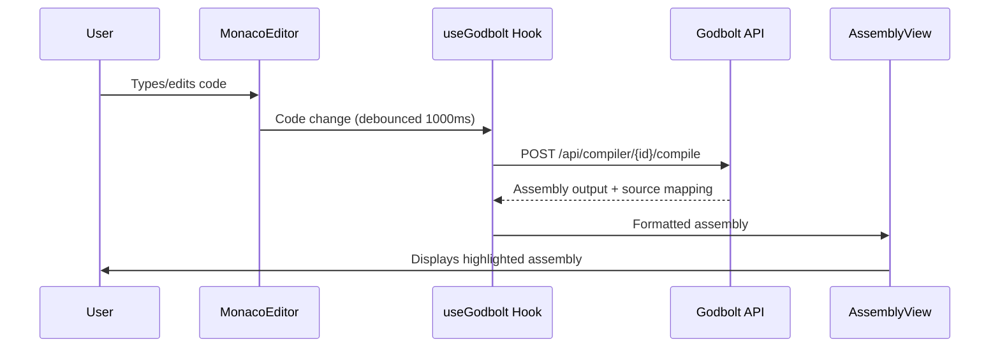

# ⚙️ BareMetal

[](LICENSE)
[](https://react.dev/)
[](https://www.typescriptlang.org/)
[](https://vite.dev/)
[](https://tailwindcss.com/)

> **The Ultimate Runtime Visualizer** — An interactive educational platform to understand how programming languages work under the hood.

)

---

## 🎯 What is BareMetal?

BareMetal is an **interactive learning platform** that helps developers understand the low-level mechanics of programming languages. Through hands-on visualizations and interactive labs, explore how code is compiled, how memory is managed, and how different concurrency models work.

### 🧪 Interactive Labs

| Lab | Description |
|-----|-------------|
| **🔧 The Compiler** | Watch code transform from high-level to machine instructions. Compare compiled vs interpreted languages. |
| **📦 The Memory** | Visualize heap vs stack, manual allocation vs garbage collection, and ownership models. |
| **💰 The Cost** | Understand hidden runtime costs of "simple" operations across different languages. |
| **🧵 The Threads** | Compare event loops, goroutines, and OS threads. See how different models handle parallel work. |
| **⚠️ The Crash** | Explore what happens when things go wrong — segfaults, panics, and how languages protect you. |

---

## 🔌 Godbolt Compiler Explorer API Integration

BareMetal uses the **Godbolt Compiler Explorer API** to provide real-time assembly output for compiled languages (C++, Go, Rust). This allows users to see how their high-level code translates to machine instructions.

### How It Works



### API Request Structure

The hook sends a POST request to `https://godbolt.org/api/compiler/{compilerId}/compile`:

```typescript
// src/hooks/useGodbolt.ts
const response = await fetch(
  `https://godbolt.org/api/compiler/${compilerId}/compile`,
  {
    method: 'POST',
    headers: {
      'Content-Type': 'application/json',
      'Accept': 'application/json',
    },
    body: JSON.stringify({
      source: sourceCode,
      options: {
        userArguments: lang === 'rust' ? '-O' : '-O2',
        filters: {
          binary: false,        // Don't show binary output
          commentOnly: true,    // Strip compiler comments
          demangle: true,       // Demangle C++ symbols
          directives: true,     // Filter assembler directives
          execute: false,       // Don't execute code
          intel: true,          // Use Intel syntax
          labels: true,         // Filter unused labels
          libraryCode: false,   // Don't show library code
          trim: true,           // Trim whitespace
        },
      },
    }),
  }
);
```

### Supported Compilers

| Language | Compiler ID | Compiler Version |
|----------|-------------|------------------|
| **C++** | `g132` | GCC 13.2 (x86-64) |
| **Go** | `gccgo132` | GCC Go 13.2 (x86) |
| **Rust** | `r1830` | rustc 1.83.0 |

### API Response Handling

The API returns assembly with source-line mapping:

```typescript
interface GodboltResponse {
  asm: Array<{ text: string; source?: { line: number } }>;
  code: number;           // Exit code (0 = success)
  stderr?: Array<{ text: string }>;  // Compiler errors/warnings
}
```

### Source-to-Assembly Mapping

When you hover over a line in the source editor, the corresponding assembly lines are highlighted:

```typescript
// Build source-to-assembly mapping
if (line.source?.line) {
  if (!sourceToAsmMap[line.source.line]) {
    sourceToAsmMap[line.source.line] = [];
  }
  sourceToAsmMap[line.source.line].push(asmLineNumber);
}
```

### Simulated Bytecode (Interpreted Languages)

Python and JavaScript don't use Godbolt. Instead, we generate **simulated bytecode** to show the conceptual intermediate representation:

```typescript
if (!compilerId) {
  setSourceToAsmMap({});
  return simulateBytecode(sourceCode, lang);
}
```

---

## 🔧 Feature Deep Dive

### The Compiler Lab (`/labs/compiler`)

**Purpose**: Show how source code transforms into machine instructions.

**Components**:
- `CompilerLab.tsx` - Main page component
- `MonacoWrapper.tsx` - Code editor with syntax highlighting
- `AssemblyView.tsx` - Formatted assembly output display
- `CompilerScenarioSelector.tsx` - Pre-built code examples

**Flow**:
1. User selects a **scenario** (Hello World, Loops, Memory Allocation, Recursion)
2. Code loads into **Monaco Editor**
3. After 1000ms debounce, `useGodbolt` hook triggers API call
4. **AssemblyView** displays formatted output with line numbers
5. Hovering source code highlights corresponding assembly

**Key Implementation Details**:
- Rust functions must be `pub` to prevent optimizer from removing them
- Rust uses `-O` optimization flag (not `-O2` like GCC/Clang)
- API filters strip noise (directives, unused labels) for clean output

### The Memory Lab (`/labs/memory`)

Interactive scenarios demonstrating memory management concepts:
- Heap vs Stack allocation
- Garbage collection timing
- Rust ownership and borrowing

### The Concurrency Lab (`/labs/concurrency`)

Visual comparison of concurrency models:
- JavaScript Event Loop
- Go Goroutines
- Rust async/await
- OS Threads

### The Cost Lab (`/labs/cost`)

Shows hidden performance costs of operations.

### The Safety Lab (`/labs/safety`)

Demonstrates runtime errors and safety guarantees.

---

## 🚀 Quick Start

### Prerequisites

- **Node.js** >= 18.0.0
- **npm** >= 9.0.0 (or **pnpm** / **yarn**)

### Installation

```bash
# Clone the repository
git clone https://github.com/Anmolawasthi117/BareMetal.git
cd BareMetal

# Install dependencies
npm install

# Start development server
npm run dev
```

The app will be available at `http://localhost:5173`

---

## 🛠️ Tech Stack

| Category | Technology |
|----------|------------|
| **Frontend Framework** | React 19.2 |
| **Language** | TypeScript 5.9 |
| **Build Tool** | Vite 7.2 |
| **Styling** | TailwindCSS 4.1 |
| **State Management** | Zustand 5.0 |
| **Code Editor** | Monaco Editor |
| **Animations** | Framer Motion |
| **Routing** | React Router 7 |
| **Compiler API** | [Godbolt Compiler Explorer](https://godbolt.org/) |

---

## 📁 Project Structure

```
BareMetal/
├── src/
│   ├── components/
│   │   ├── editor/              # Monaco editor & assembly view
│   │   │   ├── MonacoWrapper.tsx
│   │   │   └── AssemblyView.tsx
│   │   ├── compiler/            # Compiler lab components
│   │   │   └── CompilerScenarioSelector.tsx
│   │   ├── memory/              # Memory lab components
│   │   ├── concurrency/         # Concurrency lab components
│   │   └── layout/              # App shell, navigation
│   ├── data/
│   │   ├── compilerScenarios.ts   # Pre-built code examples
│   │   ├── memoryScenarios.ts
│   │   └── concurrencyScenarios.ts
│   ├── hooks/
│   │   ├── useGodbolt.ts        # ⭐ Godbolt API integration
│   │   └── useDebounce.ts
│   ├── pages/
│   │   ├── Home.tsx
│   │   └── labs/
│   │       ├── CompilerLab.tsx   # Assembly visualization
│   │       ├── MemoryLab.tsx     # Memory management
│   │       ├── CostLab.tsx       # Performance costs
│   │       ├── ConcurrencyLab.tsx # Thread models
│   │       └── SafetyLab.tsx     # Error handling
│   ├── store/
│   │   └── useLabStore.ts       # Global state (code, language, output)
│   ├── App.tsx
│   ├── main.tsx
│   └── index.css
├── public/
├── vite.config.ts
└── package.json
```

---

## 🎨 Design System

BareMetal uses a **Dark Industrial Blueprint / Sci-Fi Terminal** theme with language-specific accent colors:

| Language | Color Variable | Hex |
|----------|---------------|-----|
| C++ | `--color-neon-cpp` | `#3b82f6` |
| Python | `--color-neon-py` | `#22c55e` |
| Rust | `--color-neon-rust` | `#f97316` |
| Go | `--color-neon-go` | `#06b6d4` |
| JavaScript | `--color-neon-js` | `#eab308` |

### Typography
- **Display Font**: Space Grotesk
- **Code Font**: JetBrains Mono

---

## 📜 Available Scripts

| Command | Description |
|---------|-------------|
| `npm run dev` | Start development server with HMR |
| `npm run build` | Build for production |
| `npm run preview` | Preview production build locally |
| `npm run lint` | Run ESLint for code quality |

---

## 🤝 Contributing

We welcome contributions! Here's how you can help:

### Getting Started

1. **Fork** the repository
2. **Clone** your fork:
   ```bash
   git clone https://github.com/Anmolawasthi117/BareMetal.git
   ```
3. **Create a branch** for your feature:
   ```bash
   git checkout -b feature/amazing-feature
   ```
4. **Make your changes** and commit:
   ```bash
   git commit -m "feat: add amazing feature"
   ```
5. **Push** to your fork:
   ```bash
   git push origin feature/amazing-feature
   ```
6. **Open a Pull Request**

### Commit Convention

We follow [Conventional Commits](https://www.conventionalcommits.org/):

| Type | Description |
|------|-------------|
| `feat:` | New feature |
| `fix:` | Bug fix |
| `docs:` | Documentation changes |
| `style:` | Code style changes (formatting, etc.) |
| `refactor:` | Code refactoring |
| `test:` | Adding or updating tests |
| `chore:` | Maintenance tasks |

---

## 🐛 Reporting Issues

Found a bug or have a feature request? [Open an issue](https://github.com/Anmolawasthi117/BareMetal/issues/new) with:

- **Clear title** describing the issue
- **Steps to reproduce** (for bugs)
- **Expected vs actual behavior**
- **Screenshots** if applicable
- **Environment info** (browser, OS)

---

## 🗺️ Roadmap

- [ ] Add more language comparisons (Zig, C#, Java)
- [ ] Implement WebAssembly runtime visualizations
- [ ] Add interactive quizzes and challenges
- [ ] Support for custom code snippets
- [ ] Dark/Light theme toggle
- [ ] Mobile responsive improvements
- [ ] Guided tutorials for each lab

---

## 📄 License

This project is licensed under the **MIT License** — see the [LICENSE](LICENSE) file for details.

---

## 🙏 Acknowledgments

- [React](https://react.dev/) — UI library
- [Vite](https://vite.dev/) — Build tool
- [Monaco Editor](https://microsoft.github.io/monaco-editor/) — Code editor
- [Framer Motion](https://www.framer.com/motion/) — Animations
- [Tailwind CSS](https://tailwindcss.com/) — Styling
- [Godbolt Compiler Explorer](https://godbolt.org/) — Compiler API

---

<div align="center">
  <strong>⚙️ See the machine. Understand the code. ⚙️</strong>
  <br><br>
  Made with ❤️ by Anmolawasthi117 and contributors worldwide
</div>
